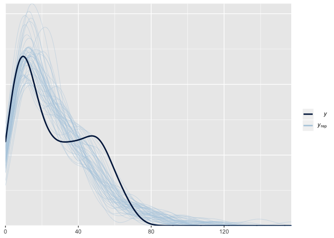
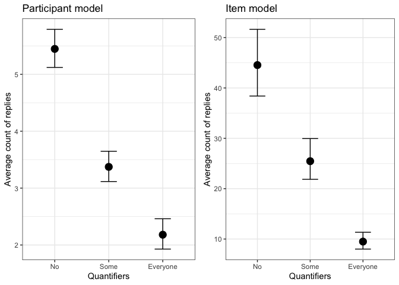
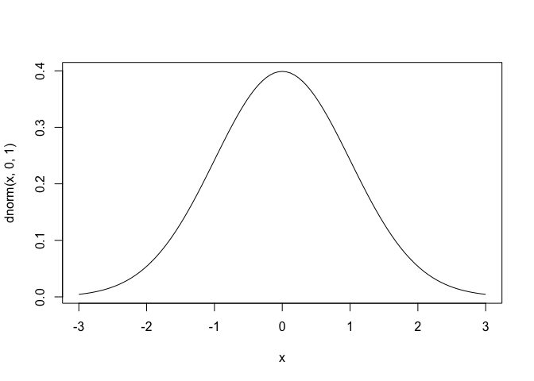
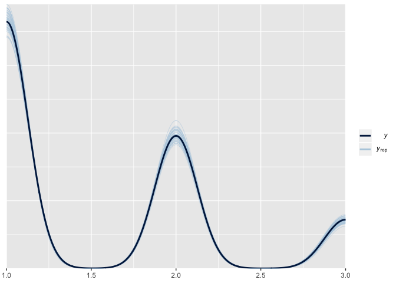
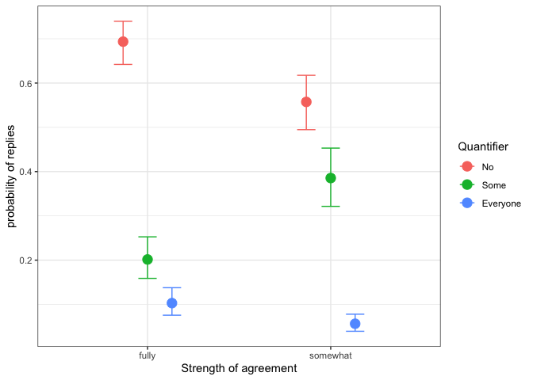

Experiment 9 ad pop
================

## Experiment 1

> Overview of the code for experiment 1, data clean-up and statistical
> models

<br>

## Data clean-up

> Overview of data

``` r
##First look at the data

prod <- read.csv("data/Arg_Production_task.csv")

str(prod)
```

    ## 'data.frame':    6762 obs. of  12 variables:
    ##  $ id          : Factor w/ 161 levels "R_10G95VMd02uAG8e",..: 130 130 130 130 130 130 130 130 130 130 ...
    ##  $ item        : Factor w/ 42 levels "F10x","F11x",..: 34 35 36 37 38 39 40 41 42 25 ...
    ##  $ item.type   : Factor w/ 2 levels "critical","filler": 1 1 1 1 1 1 1 1 1 1 ...
    ##  $ statement   : int  1 4 4 2 1 2 3 1 1 1 ...
    ##  $ statement.rt: num  3.08 3.03 4.21 7.03 3.84 ...
    ##  $ agreement   : Factor w/ 3 levels "agree","disagree",..: 1 2 2 1 1 1 2 1 1 1 ...
    ##  $ strength    : Factor w/ 3 levels "filler","fully",..: 2 2 2 3 2 3 3 2 2 2 ...
    ##  $ argument    : int  3 3 3 2 2 2 2 1 1 3 ...
    ##  $ argument.rt : num  3.23 3.24 5.55 3.13 5.75 ...
    ##  $ word.count  : int  286 194 239 205 193 218 233 191 175 181 ...
    ##  $ gender      : int  2 2 2 2 2 2 2 2 2 2 ...
    ##  $ age         : int  35 35 35 35 35 35 35 35 35 35 ...

``` r
head(prod)
```

    ##                  id item item.type statement statement.rt agreement strength argument argument.rt word.count gender age
    ## 1 R_AFjOleDXKveANvX  I1x  critical         1        3.079     agree    fully        3       3.234        286      2  35
    ## 2 R_AFjOleDXKveANvX  I2x  critical         4        3.034  disagree    fully        3       3.243        194      2  35
    ## 3 R_AFjOleDXKveANvX  I3x  critical         4        4.207  disagree    fully        3       5.547        239      2  35
    ## 4 R_AFjOleDXKveANvX  I4x  critical         2        7.027     agree somewhat        2       3.135        205      2  35
    ## 5 R_AFjOleDXKveANvX  I5x  critical         1        3.840     agree    fully        2       5.748        193      2  35
    ## 6 R_AFjOleDXKveANvX  I6x  critical         2        3.383     agree somewhat        2       6.313        218      2  35


<br>

> Data transformation to set the correct labels for factors and the
> correct factor order for the statistical analysis. For this analysis
> we use dummy coding with “No” as our base level of comparison

``` r
prod_data <- prod %>% 
   
   ##reorder the levels of factors for analysis
   mutate(
      argument = factor(argument, 
                        levels = c("3", "2", "1")),
      statement = factor(statement,
                         levels = c("1", "2", "3", "4"))
   ) %>%
   
   ##rename the variables
   mutate(
      argument = recode(argument,
                        "3" = "No", 
                        "2" = "Some", 
                        "1" = "Everyone"),
      statement = recode(statement,
                         "1" = "Strong.Agree", 
                         "2" = "Somewhat.Agree", 
                         "3" = "Somewhat.Disagree", 
                         "4" = "Strong.Disagree")
   ) 

  
##leave only the complete cases 
prod_data <- prod_data[complete.cases(prod_data),]


prod_tsk <- prod_data %>%
   
   ##subset the data to only include the critical items, no fillers
   subset(
      item.type == "critical"
   ) %<>% 
   
   ##converting variables to factors
   mutate_at(
      c("item.type","strength", "agreement"), funs(factor(.))
   )
```

    ## Warning: funs() is soft deprecated as of dplyr 0.8.0
    ## Please use a list of either functions or lambdas: 
    ## 
    ##   # Simple named list: 
    ##   list(mean = mean, median = median)
    ## 
    ##   # Auto named with `tibble::lst()`: 
    ##   tibble::lst(mean, median)
    ## 
    ##   # Using lambdas
    ##   list(~ mean(., trim = .2), ~ median(., na.rm = TRUE))
    ## This warning is displayed once per session.

<br>

> Results of transformations

``` r
str(prod_tsk)
```

    ## 'data.frame':    2896 obs. of  12 variables:
    ##  $ id          : Factor w/ 161 levels "R_10G95VMd02uAG8e",..: 130 130 130 130 130 130 130 130 130 130 ...
    ##  $ item        : Factor w/ 42 levels "F10x","F11x",..: 34 35 36 37 38 39 40 41 42 25 ...
    ##  $ item.type   : Factor w/ 1 level "critical": 1 1 1 1 1 1 1 1 1 1 ...
    ##  $ statement   : Factor w/ 4 levels "Strong.Agree",..: 1 4 4 2 1 2 3 1 1 1 ...
    ##  $ statement.rt: num  3.08 3.03 4.21 7.03 3.84 ...
    ##  $ agreement   : Factor w/ 2 levels "agree","disagree": 1 2 2 1 1 1 2 1 1 1 ...
    ##  $ strength    : Factor w/ 2 levels "fully","somewhat": 1 1 1 2 1 2 2 1 1 1 ...
    ##  $ argument    : Factor w/ 3 levels "No","Some","Everyone": 1 1 1 2 2 2 2 3 3 1 ...
    ##  $ argument.rt : num  3.23 3.24 5.55 3.13 5.75 ...
    ##  $ word.count  : int  286 194 239 205 193 218 233 191 175 181 ...
    ##  $ gender      : int  2 2 2 2 2 2 2 2 2 2 ...
    ##  $ age         : int  35 35 35 35 35 35 35 35 35 35 ...

<br>

> Crate the data frame for plot 0 and plot 1

``` r
##create the counts for each argument choosen 
prod_count <- prod_tsk %>%
   
   ##count data
   count(argument
   ) %>%
   
   ##percentage data using the n which is taken from count argument
   mutate(
      pctg = ((n/sum(n))*100)
   )
```

<br>

> Plot 0, results of the experiment using counts

``` r
##plot of counts
ggplot(prod_count, aes(x = argument, y = n)) + 
   geom_bar(stat = "identity", aes(fill = argument))  +  
   coord_cartesian(ylim = c(0, 1900)) +
   ylab("Count of total replies") +
   xlab("Quantifier chosen") +
   ggtitle("Count of arguments chosen") +
   theme_bw()
```

<!-- -->

<br>

> Plot 1, results of the experiment using percentages

``` r
##plot of percentages
ggplot(prod_count, aes(x = argument, y = pctg)) + 
   geom_bar(stat = "identity", aes(fill = argument))  +  
   coord_cartesian(ylim = c(0, 100)) +
   ylab("% of total replies") +
   xlab("Quantifier") +
   labs(fill = "Quantifier") +
   theme_bw()
```

<!-- -->

<br>

> Create the data frame for plot 3, with agreement strength as the
> facceting variable. There seems to be a difference between choices of
> somewhat based on agreement strength

``` r
##data and plots for arguments devided by strength
prod_count_2 <- prod_tsk %>%
   
   ##calculate counts
   count(argument,strength
   ) %>% 
   
   ##calcualte percentages 
   mutate(pctg = ((n/sum(n))*100)
   )


ggplot(prod_count_2, aes(x = argument, y = pctg)) + 
   geom_bar(stat = "identity", aes(fill = argument))  +  
   coord_cartesian(ylim = c(0, 40)) +
   ylab("% of total replies") +
   xlab("Quantifier") +
   facet_wrap(~strength) +
   labs(fill = "Quantifier") +
   theme_bw()
```

<!-- -->

<br>

## Chi squared model

> Create the table for a chi squared test and run the test results.
> Clear indication for a difference between the 3 groups of expressions

``` r
##table for the chi square analysis
M <- as.table(cbind(c(1669, 897, 330)))


dimnames(M) <- list(quantifier = c("No", "Some", "Everyone"),
                    responses = c("count"))


##chi square test and summary
chi.counts <- chisq.test(M)
chi.counts
```

    ## 
    ##  Chi-squared test for given probabilities
    ## 
    ## data:  M
    ## X-squared = 935.91, df = 2, p-value < 2.2e-16

``` r
chi.counts$observed   # observed counts (same as M)
```

    ## [1] 1669  897  330

``` r
chi.counts$expected   # expected counts under the null
```

    ## [1] 965.3333 965.3333 965.3333

``` r
chi.counts$residuals  # Pearson residuals
```

    ## [1]  22.647920  -2.199348 -20.448572

``` r
chi.counts$stdres     # standardized residuals
```

    ## [1]  27.73792  -2.69364 -25.04428

<br>

## Bayesian Models 1 and 2

> Create the participant(id) data frame for Bayesian model testing. This
> will be our first model, with particiapnt only data

``` r
prod_count_id <- prod_tsk %>% 
   count(argument, strength, id)

head(prod_count_id)
```

    ## # A tibble: 6 x 4
    ##   argument strength id                     n
    ##   <fct>    <fct>    <fct>              <int>
    ## 1 No       fully    R_10G95VMd02uAG8e     10
    ## 2 No       fully    R_10xFyMsSdyEaZce      2
    ## 3 No       fully    R_11i2LVvE735amy5x     7
    ## 4 No       fully    R_12tLuVuYppnsRaO      8
    ## 5 No       fully    R_1CfMlGULuQMIPkJ      7
    ## 6 No       fully    R_1dLzSxJBUeftrIB      3

``` r
##average value for a reply
mean(prod_count_id$n)
```

    ## [1] 3.994483

<br>

> Create the item data frame for Bayesian model testing. This will be
> our second model with item only data

``` r
prod_count_item <- prod_tsk %>% 
   count(argument, strength, item)


head(prod_count_item)
```

    ## # A tibble: 6 x 4
    ##   argument strength item      n
    ##   <fct>    <fct>    <fct> <int>
    ## 1 No       fully    I10x     63
    ## 2 No       fully    I11x     35
    ## 3 No       fully    I12x     32
    ## 4 No       fully    I13x     15
    ## 5 No       fully    I14x     39
    ## 6 No       fully    I15x     59

``` r
##average value for a reply
mean(prod_count_item$n)
```

    ## [1] 26.81481

<br>

> illustration of the chosen prior distributions for model 1 and model
> 2. Since the responses in our models (negative binomial) will be on
> the log scale we look at dlnorm() function to simulate our priors,
> nothing below 0 will be modeled (see Mcelerth (2016) p354)

``` r
##prior for model 1
curve(dlnorm(x, 2, 1), from = 0, to = 40) 
```

<!-- -->

``` r
##prior for model 2
curve(dlnorm(x, 3, 1), from = 0, to = 60) 
```

<!-- -->

<br>

#### Setting up Model 1, for participants only

<br>

> Null model fitted with brms package, using negative binomial family
> and our defined prior of N(2,1) for intercept

``` r
##null model for participants
bm2n <- brm(n ~ 1 + (1|id), 
           family = negbinomial(link = log),
           prior = c(set_prior("normal(2,1)", class = "Intercept")),
           sample_prior = TRUE,
           save_all_pars = TRUE,
           iter = 4000,
           cores = 2,
           data = prod_count_id)

bm2n_l <- loo(bm2n)
```

<br>

> Intercept model (model with only varrying intercept for group level
> effects) fitted with brms package, using negative binomial family and
> our defined prior of N(2,1) for intercept

``` r
## intercept model for participants
bm2 <- brm(n ~ argument + (1|id), 
           family = negbinomial(link = log),
           prior = c(set_prior("normal(2,1)", class = "b"), 
                     set_prior("normal(2,1)", class = "Intercept")),
           sample_prior = TRUE,
           save_all_pars = TRUE,
           iter = 4000,
           cores = 2,
           data = prod_count_id)

bm2_l <- loo(bm2)
```

> Posterior probability checks for the model (the ability of the model
> to reproduce our data). The model has a small skew to the left but
> otherwise it is quite
precise.

``` r
pp_check(bm2, nsamples = 50)
```

<!-- -->

<br>

> Comparison of the two models using the leave one out corss validation
> (loo package in R).

``` r
loo_compare(bm2n_l,bm2_l) ## simple loo comparison
```

    ##      elpd_diff se_diff
    ## bm2    0.0       0.0  
    ## bm2n -97.2      12.5

<br>

> Intercept and uncorrelated slope model (model with varrying intercept
> and slope for group level effects) fitted with brms package, using
> negative binomial family and our defined prior of N(2,1) for intercept

``` r
##slope without correlated intercpet model for participants
bm2.2 <- brm(n ~ argument + (argument||id), 
             family = negbinomial(link = log),
             prior = c(set_prior("normal(2,1)", class = "b"), 
                       set_prior("normal(2,1)", class = "Intercept")),
             sample_prior = TRUE,
             save_all_pars = TRUE,
             cores = 2,
             data = prod_count_id)

bm2.2_l <- loo(bm2.2) 
```

<br>

> Comparison of the three models using the the same proceedure as above.
> No clear evidence to prefer the intecrept and slope model. In this
> case choice falls for the more parsimonious model bm2

``` r
loo_compare(bm2_l,bm2.2_l, bm2n_l) ## simple loo comparison
```

    ##       elpd_diff se_diff
    ## bm2     0.0       0.0  
    ## bm2.2  -1.6       1.0  
    ## bm2n  -97.2      12.5

<br>

#### Setting up Model 2, for items only

<br>

> Null model for items

``` r
##null model for items
bm3n <- brm(n ~ 1 + (1|item), 
           family = negbinomial(link = log),
           prior = c(set_prior("normal(3,1)", class = "Intercept")),
           sample_prior = TRUE,
           save_all_pars = TRUE,
           iter = 4000,
           cores = 2,
           data = prod_count_item)

bm3n_l <- loo(bm3n)
```

<br>

> Intercept model (model with only varrying intercept for group level
> effects) fitted with brms package, using negative binomial family and
> our defined prior of N(3,1) for intercept

``` r
##intercept model for items
bm3 <- brm(n ~ argument + (1|item), 
           family = negbinomial(link = log),
           prior = c(set_prior("normal(3,1)", class = "b"), 
                     set_prior("normal(3,1)", class = "Intercept")),
           sample_prior = TRUE,
           save_all_pars = TRUE,
           iter = 4000,
           cores = 2,
           data = prod_count_item)

bm3_l <- loo(bm3)
```

<br>

> Posterior probability checks for the model (the ability of the model
> to reproduce our data). The model has a small skew around the 50 value
> mark but in general it is quite
precise.

``` r
pp_check(bm3, nsamples = 50)
```

<!-- -->

<br>

> Comparison of the two models using the leave one out cross validation.

``` r
loo_compare(bm3n_l, bm3_l) ## simple loo comparison
```

    ##      elpd_diff se_diff
    ## bm3    0.0       0.0  
    ## bm3n -54.4       7.9

<br>

> Intercept and uncorrelated slope model (model with varrying intercept
> and slope for group level effects) fitted with brms package, using
> negative binomial family and our defined prior of N(2,1) for intercept

``` r
##intercept and uncorrelated slope model for items
bm3.2 <- brm(n ~ argument + (argument||item), 
           family = poisson(link = log),
           prior = c(set_prior("normal(3,1)", class = "b"), 
                     set_prior("normal(3,1)", class = "Intercept")),
           sample_prior = TRUE,
           save_all_pars = TRUE,
           iter = 4000,
           cores = 2,
           data = prod_count_item)

bm3.2_l <- loo(bm3.2)
```

<br>

> Comparison of the two models using the same proceedure as above. No
> evidence to prefer the intecrept and slope model.

``` r
loo_compare(bm3_l,bm3.2_l,bm3n_l) ## simple loo comparison
```

    ##       elpd_diff se_diff
    ## bm3      0.0       0.0 
    ## bm3n   -54.4       7.9 
    ## bm3.2 -149.4      29.1

<br>

> Plot 2 with the result (marginal effects) of our chosen models
> (participants and items)

``` r
##plot of the model
cc <- plot(marginal_effects(bm2, plot = F)) [[1]] + theme_bw() +
   xlab("Quantifiers") + ylab("Average count of replies") + 
   ggtitle("Participant model")
```

``` r
##plot of model
cc2 <- plot(marginal_effects(bm3, plot = F)) [[1]] + theme_bw() +
   xlab("Quantifiers") + ylab("Average count of replies") +
   ggtitle("Item model")
```

``` r
##plot of both items and participant models
gridExtra::grid.arrange(cc,cc2, nrow = 1)
```

<!-- -->

<br>

## Bayesian Model3

<br>

> Illustration of chosen prior distributions for model 3. In this case
> we are dealing with a categorical model with a logit link, so we look
> at our priors on a gaussain probability scale.

``` r
##prior for model 3
curve(dnorm(x, 0, 1), from = -3, to = 3)
```

<!-- -->

<br>

> null model with our defined priors on intercept

``` r
##null model
bm4.n <- brm(argument ~ 1 + (1|id) + (1|item), 
           family = categorical(link = logit),
           prior = c(set_prior("normal(0,1)", class = "Intercept")),
           sample_prior = TRUE,
           save_all_pars = TRUE,
           iter = 4000,
           cores = 2,
           data = prod_tsk)
           
bm4n_l <- loo(bm4.n)
```

<br>

> Intercept only model with intercepts as only group level effects

``` r
bm4 <- brm(argument ~ 0 + Intercept + strength + (1|id) + (1|item), 
           family = categorical(link = logit),
           prior = c(set_prior("normal(0,1)", class = "b")),
           sample_prior = TRUE,
           save_all_pars = TRUE,
           cores = 2,
           iter = 4000,
           data = prod_tsk)

bm4_l <- loo(bm4)
```

<br>

> Looking at posterior probability checks for the model (the ability of
> the model to reproduce our data). The model has a small skew to the
> left but in general it is quite
precise.

``` r
pp_check(bm4, nsamples = 50)
```

<!-- -->

<br>

> Comparison of the two models. Clear indication for preference for the
> intercept Model bm4

``` r
loo_compare(bm4n_l, bm4_l) ## simple loo comparison
```

    ##       elpd_diff se_diff
    ## bm4     0.0       0.0  
    ## bm4.n -42.1       9.8

<br>

> Bayes factor for variables in our Intercept model. In both cases we
> see that there is strong evidence for the difference between strength
> of argument and how it affects choice of Some or Everyone. BF01 \<
> 0.00001 in both cases, meaning that all the posterior samples from our
> test are on the sameside of the value dividing the hypothesis (see
> Burkner
2017)

``` r
hypothesis(bm4, "exp(muSome_strengthsomewhat) = exp(muSome_Intercept)") ## BayesFactor test with Savage-Dickey method for equality of Some across both levels of agreement strength
```

    ## Hypothesis Tests for class b:
    ##                 Hypothesis Estimate Est.Error CI.Lower CI.Upper Evid.Ratio Post.Prob Star
    ## 1 (exp(muSome_stren... = 0      2.1      0.27      1.6     2.66          0         0    *
    ## ---
    ## 'CI': 90%-CI for one-sided and 95%-CI for two-sided hypotheses.
    ## '*': For one-sided hypotheses, the posterior probability exceeds 95%;
    ## for two-sided hypotheses, the value tested against lies outside the 95%-CI.
    ## Posterior probabilities of point hypotheses assume equal prior probabilities.

``` r
hypothesis(bm4, "exp(muEveryone_strengthsomewhat) = exp(muEveryone_Intercept)") ## BayesFactor test with Savage-Dickey method for equality of Everyone across both levels of agreement strength
```

    ## Hypothesis Tests for class b:
    ##                 Hypothesis Estimate Est.Error CI.Lower CI.Upper Evid.Ratio Post.Prob Star
    ## 1 (exp(muEveryone_s... = 0     0.54      0.11     0.33     0.77          0         0    *
    ## ---
    ## 'CI': 90%-CI for one-sided and 95%-CI for two-sided hypotheses.
    ## '*': For one-sided hypotheses, the posterior probability exceeds 95%;
    ## for two-sided hypotheses, the value tested against lies outside the 95%-CI.
    ## Posterior probabilities of point hypotheses assume equal prior probabilities.

<br>

> Intercept and uncorrelated slope
model

``` r
bm4.2 <- brm(argument ~ 0 + Intercept + strength + (strength||id) + (strength||item), 
           family = categorical(link = logit),
           prior = c(set_prior("normal(0,1)", class = "b"), 
                     set_prior("normal(0,1)", class = "Intercept")),
           sample_prior = TRUE,
           save_all_pars = TRUE,
           cores = 2,
           iter = 4000,
           data = prod_tsk)

bm4.2_l <- loo(bm4.2)
```

<br>

> Comparison of the two models using the loo package. No clear
> indication for preference for the intecrept and slope model. Intercept
> only model seems to be on par with the more complex model

``` r
loo_compare(bm4_l,bm4.2_l, bm4n_l) ## simple loo comparison
```

    ##       elpd_diff se_diff
    ## bm4     0.0       0.0  
    ## bm4.2  -1.6       1.9  
    ## bm4.n -42.1       9.8

<br>

> Plot of our chosen model (Intercept
only)

``` r
plot(marginal_effects(bm4x, probs = c(.05,.95), plot = F, categorical = TRUE)) [[1]] + theme_bw() +
   xlab("Strength of agreement") + ylab("probability of replies") + 
   labs(colour = "Quantifier", fill = "Quantifier")
```

<!-- -->
