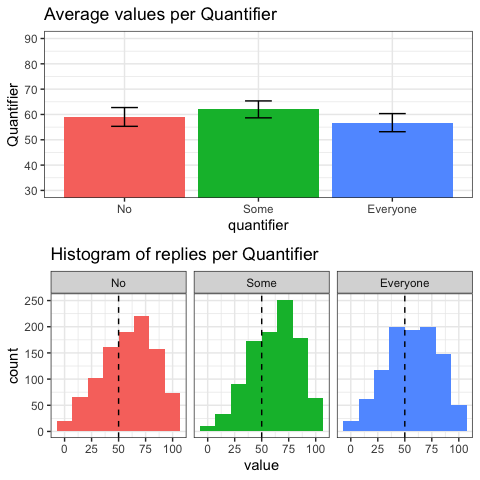
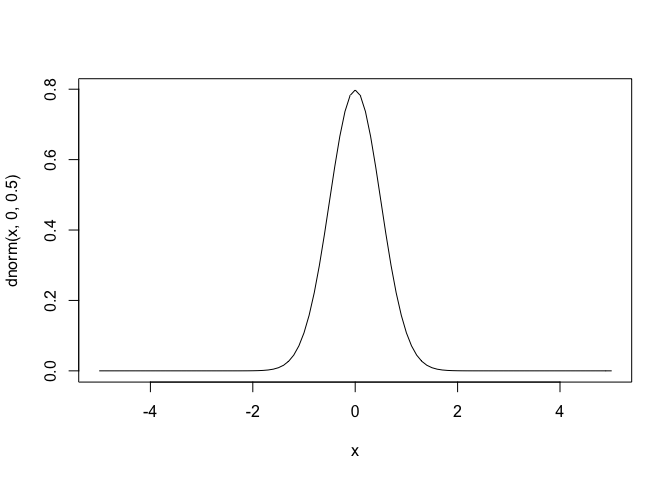
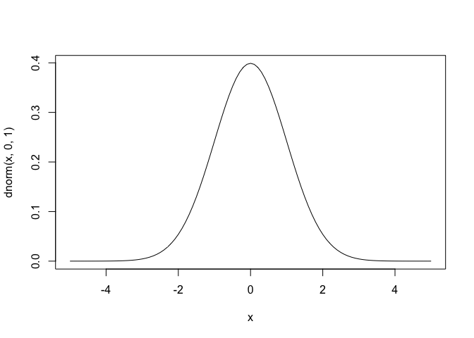
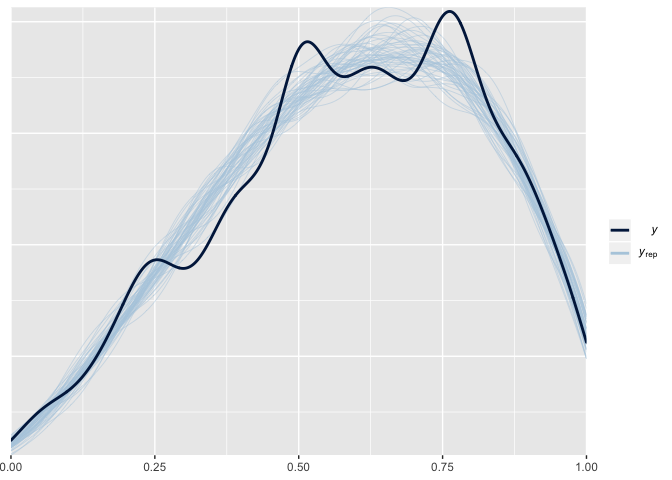
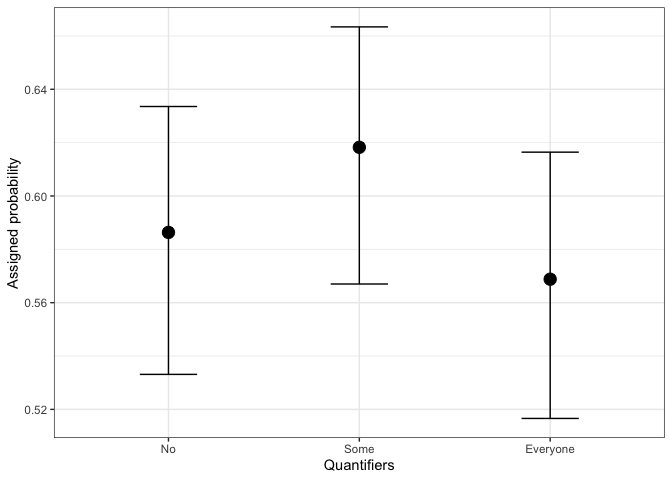

Experiment 9 ad pop
================

## Experiment 2

> Overview of the code for experiment 2, data clean-up and statistical
> models

<br>

## Data clean-up

> Overview of data

``` r
##First look at the data

prod <- read.csv("data/Anchoring_task.csv")

str(prod)
```

    ## 'data.frame':    2970 obs. of  4 variables:
    ##  $ id        : Factor w/ 166 levels "R_08QdsHlOuNvEEUx",..: 146 146 146 146 146 146 146 146 146 146 ...
    ##  $ item      : Factor w/ 18 levels "I1","I10","I11",..: 1 11 12 13 14 15 16 17 18 2 ...
    ##  $ quantifier: Factor w/ 3 levels "Everyone","No",..: 1 1 1 1 1 1 3 3 3 3 ...
    ##  $ value     : int  64 24 21 30 78 18 17 88 37 68 ...

``` r
head(prod)
```

    ##                  id item quantifier value
    ## 1 R_psJ3KgDEl3wsnx7   I1   Everyone    64
    ## 2 R_psJ3KgDEl3wsnx7   I2   Everyone    24
    ## 3 R_psJ3KgDEl3wsnx7   I3   Everyone    21
    ## 4 R_psJ3KgDEl3wsnx7   I4   Everyone    30
    ## 5 R_psJ3KgDEl3wsnx7   I5   Everyone    78
    ## 6 R_psJ3KgDEl3wsnx7   I6   Everyone    18

<br>

> Data transformation to set the correct order for factors. For this
> analysis we use dummy coding with “No” as our base level of comparison

``` r
##Change the factor levels to set dummy coding with No as base level
anchoring$quantifier <- factor(anchoring$quantifier, 
                         levels = c("No", "Some", "Everyone"))
```

<br>

> Summary of data, with mean, SD and
CI

``` r
##function to calculate confidence intervals with a gaussian normal distribution
ci <- function(x,y) {
  qnorm(0.975)*sd(x)/sqrt(length(unique(y)))
}

##summary of data
anchoring_sum <- anchoring %>%
  
  ##grouping element by quantifier
  group_by(
    quantifier
  ) %>%
  
  ##calculating mean sd and ci for each quantifier
  summarise(
    count = n(),
    mean = mean(value, na.rm = TRUE),
    sd = sd(value, na.rm = TRUE),
    ci = ci(value, id)
  )

anchoring_sum
```

    ## # A tibble: 3 x 5
    ##   quantifier count  mean    sd    ci
    ##   <fct>      <int> <dbl> <dbl> <dbl>
    ## 1 No           990  59.0  24.3  3.71
    ## 2 Some         990  62.0  22.0  3.35
    ## 3 Everyone     990  56.8  23.5  3.58

<br>

> Plot of data summary with means and historgrams

``` r
##plot of summary
anchoring_plot <- ggplot(anchoring_sum, aes(x=quantifier, y=mean)) +
  geom_bar(stat = "identity", aes(fill = quantifier)) +
  coord_cartesian(ylim = c(30,90)) + scale_y_continuous(breaks=seq(30, 90, by = 10)) +
  geom_errorbar(aes(ymin= mean - ci, ymax = mean + ci), colour = "black", width = 0.2) +
  labs(fill = "Quantifier") +
  ylab("Quantifier") +
  ggtitle("Average values per Quantifier") +
  theme_bw() +
  theme(legend.position = "none")

##plot of histograms faceted by quantifier levels
h_plot <- ggplot(anchoring) +
  geom_histogram(aes(x=value, fill = quantifier), bins = 8) +
  geom_vline(xintercept = 50, size = .5, colour = "black",
             linetype = "dashed") +
  scale_x_continuous(breaks = seq(0, 100, 25)) +
  labs(fill = "Quantifier") +
  ggtitle("Histogram of replies per Quantifier") +
  theme_bw() +
  theme(legend.position = "none")+
  facet_wrap(~quantifier)

##combination of both plots
gridExtra::grid.arrange(anchoring_plot,h_plot, nrow = 2)
```



<br>

## Bayesian Model 4

> Illustration of the chosen prior distributiosn for the model 4 for
> intercept, slope (under b) and group level under sd. For our
> zero-one-inflated beta family model (expressed with a logit link) we
> use normal distribution priors with center value of 0.5 and sd of .5
> and 1 respectivly. To convert log odds back to scores we use the
> formula 1/(1+exp(-alpha)) where alpha is our model value.
> 1/(1+exp(-0)) = 0.5

``` r
##defining priors
prior_z <- c(set_prior("normal(0,.5)", class = "b"),
             set_prior("normal(0,1)", class = "sd"))

##illustration of the priors selected
curve(dnorm(x, 0,  .5) , from=-5, to=5)
```

<!-- -->

``` r
curve(dnorm(x, 0,  1) , from=-5, to=5)
```

<!-- -->

<br>

> Null model fitted with brms package, zero-one-inflated beta family and
> our defined prior of N(0,.5).

``` r
##Null model 
fit2n <- brm((value/100) ~ 1 + (1|id) + (1|item), 
             family = "zero_one_inflated_beta",
             sample_prior = TRUE,
             save_all_pars = TRUE,
             prior = set_prior("normal(0,.5)", class = "Intercept"),
             cores = 2,
             data = anchoring)

fit2n_l <- loo(fit2n)
```

<br>

> Intercept model with our defined priors in prior\_z.

``` r
##Intercept model
fit2z <- brm((value/100) ~ 0 + Intercept + quantifier + (1|id) + (1|item), 
             family = "zero_one_inflated_beta",
             sample_prior = TRUE,
             save_all_pars = TRUE,
             prior = prior_z,
             cores = 2,
             data = anchoring)

fit2z_l <- loo(fit2z)
```

<br>

> Posterior probability checks for the model (the ability of the model
> to reproduce our data). The model has small issues with capturing some
> of the bumps in the data, but oterwise is qute precise. The bumps are
> introduced as an artifact of labels at 0, 25, 50, 75 and 100
> percentages

``` r
pp_check(fit2z, nsamples = 50)
```

<!-- -->

<br>

> Comparison of the two models using the leave one out corss validation
> (loo package in R). Intercept model seems to offer better fit.

``` r
loo_compare(fit2n_l,fit2z_l) ## simple loo comparison
```

    ##       elpd_diff se_diff
    ## fit2z   0.0       0.0  
    ## fit2n -15.8       5.7

<br>

> Intercept and uncorrelated slope model. Adding 4000 iterations to
> allow for exrtra compelxity

``` r
##Intercept and uncorrelated slope model
fit2y <- brm((value/100) ~ 0 + Intercept + quantifier + (quantifier||id) + (quantifier||item), 
             family = "zero_one_inflated_beta",
             sample_prior = TRUE,
             save_all_pars = TRUE,
             prior = prior_z,
             iter = 4000,
             cores = 2,
             data = anchoring)

fit2y_l<- loo(fit2y)
```

<br>

> Comparison of the three models using the leave one out corss
> validation (loo package in R). The Intercept and Slope model offers a
> better fit.

``` r
##simple loo comparions of the three models
loo_compare(fit2z_l,fit2y_l, fit2n_l)
```

    ##       elpd_diff se_diff
    ## fit2y   0.0       0.0  
    ## fit2z -16.1       6.1  
    ## fit2n -31.9       8.6

<br>

> Posterior probability checks for the Intercept and Slope model (the
> ability of the model to reproduce our data). The model seems to
> capture the data in a similar way as our Intercept only
model

``` r
pp_check(fit2y, nsamples = 50)
```

<!-- -->

<br>

> Bayes factor for variables in our Intercept and uncorrelated slope
> model. In the first case we see that there is evidence for difference
> between Some and No (this outcome is approx 6 times more likely; BF10
> = 1/0.16 = 6.25). In the second case we see that there is evidence for
> equaltiy between Everyone and No, BF01 =
3.25.

``` r
##BayesFactor test using Savage-Dickey density ratio between quantifierEveryone and quantifierNo 
hypothesis(fit2y, "1/(1+exp(-(Intercept + quantifierEveryone))) = 1/(1+exp(-(Intercept)))")
```

    ## Hypothesis Tests for class b:
    ##                 Hypothesis Estimate Est.Error CI.Lower CI.Upper Evid.Ratio Post.Prob Star
    ## 1 (1/(1+exp(-(Inter... = 0    -0.02      0.01    -0.04        0       3.25      0.76        
    ## ---
    ## 'CI': 90%-CI for one-sided and 95%-CI for two-sided hypotheses.
    ## '*': For one-sided hypotheses, the posterior probability exceeds 95%;
    ## for two-sided hypotheses, the value tested against lies outside the 95%-CI.
    ## Posterior probabilities of point hypotheses assume equal prior probabilities.

``` r
##BayesFactor test  using Savage-Dickey density ratio between quantifierSome and quantifierNo 
hypothesis(fit2y, "1/(1+exp(-(Intercept + quantifierSome))) = 1/(1+exp(-(Intercept)))")
```

    ## Hypothesis Tests for class b:
    ##                 Hypothesis Estimate Est.Error CI.Lower CI.Upper Evid.Ratio Post.Prob Star
    ## 1 (1/(1+exp(-(Inter... = 0     0.03      0.01     0.01     0.05       0.16      0.14    *
    ## ---
    ## 'CI': 90%-CI for one-sided and 95%-CI for two-sided hypotheses.
    ## '*': For one-sided hypotheses, the posterior probability exceeds 95%;
    ## for two-sided hypotheses, the value tested against lies outside the 95%-CI.
    ## Posterior probabilities of point hypotheses assume equal prior probabilities.

<br>

> Plot of our chosen model (Intercept and uncorrelated slope)

``` r
##marginal effects plot for the model
plot(marginal_effects(fit2z, probs = c(.05,.95), plot = F)) [[1]] + theme_bw() +
  xlab("Quantifiers") + ylab("Assigned probability") 
```

<!-- -->
